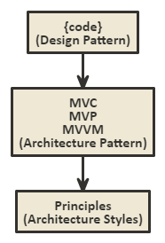

# design-patterns-project

Design pattern is time tested solution for architecture problems 

## Difference between design pattern, architectural pattern and architecture style

* Design pattern is code level  
* Architectural pattern is like MVC, MVP and MVVM  
* Architecture style is principle like REST, SOA, etc 

  

## Design Pattern 

Design pattern is time tested solution for architecture problems 
GoF Design pattern having 3 types,
* Creational design pattern (Instantiation problem)
* Structural design pattern (Class creation problem)
* Behavioral design pattern (Runtime problem)